

# What is this?

Performance comparison of various implementations of three
[Bron-Kerbosch algorithms](http://en.wikipedia.org/wiki/Bron-Kerbosch_algorithm)
to find all maximal cliques in a graph.

Some algorithm variants (IK_*) are described in the 2008 paper by F. Cazals & C. Karande,
“A note on the problem of reporting maximal cliques”,
Theoretical Computer Science, 407 (1): 564–568, doi:10.1016/j.tcs.2008.05.010.

The purpose of this fork is not only to compare the algorithms, but also programming languages,
 library choices, and the effect of optimization, chiefly parallelism.

Compared to the original project this is forked from, the code is:
* converted from python 2 to python 3.9
* (hopefully) clarified and type safe
* extended with variations on the algorithms
* extended with unit tests, property based testing, and a performance test on random graphs
* most of in Rust, Java, Go, C++ and partly in C# and Scala

Beware that my Scala knowledge and code is the least developed of all languages.

All charts below show the amount of time spent on the same particular Windows machine with 6 core CPU,
all on the same predetermined random graph, with error bars showing the minimum and maximum
over 5 or 3 samples.
Order of a graph = number of vertices.

A random graph is easy to generate and objective, but not ideal to test the performance of the
algorithm itself, because when you're looking for maximal cliques, the actual data most likely
comes in cliques, some of which are near-maximal and cause the heartaches described in the paper.

# Executive summary
* Better algorithms invented to counter treacherous cases stand their ground on a vanilla random graph.
* Programming language makes a difference, as in factor 2 up to 8.
  - Rust is clearly the fastest, but beware I contributed some performance improvements to its
    collection library, more than I invested in the other, more established languages.
  - C# is the runner up, surpringly (to me).
  - Python is the slowest, not surprisingly.
  - C++ is clearly not the fastest (and I claim this with the confidence of 20 years of professional C++ development).
* Multi-threading helps a lot too, and how programming languages accommodate for it makes a huge difference.
  Python is the worst in that respect, I couldn't get any multi-threading code to work faster than the single-threaded code.
* Collection libraries don't matter much, though hashing reaches sizes a B-tree can only dream of.

# Report of results
## Local optimization

Let's first get one thing out of the way: what does some local optimization yield in the simplest,
naive Bron-Kerbosch algorithm, in Python and Rust. Is this premature optimization or low hanging fruit?

* **Ver1:** Same as in the original project
* **Ver1½:** Same locally optimized, without changing the algorithm as such.
In particular:
  - In the (many) deepest iterations, when we see the intersection of candidates is empty, don't
    calculate all the nearby excluded vertices, just check if that set is empty or not.
  - In Rust, compile a `Clique` from the call stack, instead of passing it around on the heap.
    Basically showing off Rust's ability to guarantee, at compile time, this can be done safely.

### Results

We gain as much as through switching to the best performing programming language
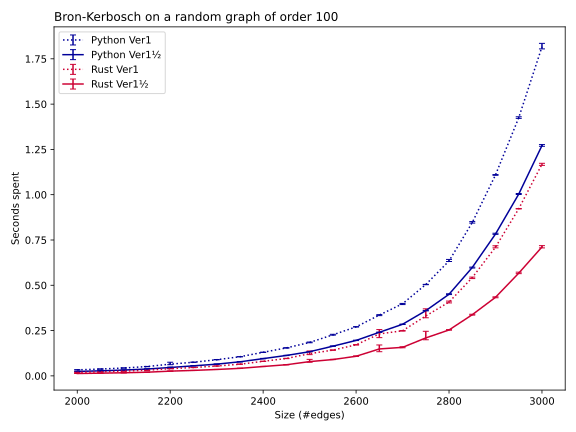

Therefore, all the other implementations will contain similar tweaks.

## Comparing algorithms

* **Ver2:** Ver1 excluding neighbours of a pivot that is chosen arbitrarily
* **Ver2-GP:** Ver2 but pivot is the candidate of the highest degree towards the remaining candidates (IK\_GP in the paper)
* **Ver2-GPX:** Ver2-GP but pivot also chosen from excluded vertices (IK\_GPX in the paper)
* **Ver2-RP:** Similar but but with pivot randomly chosen from candidates (IK\_RP in the paper)
* **Ver3:** Ver2 with degeneracy ordering
* **Ver3-GP:** Ver2-GP with degeneracy ordering
* **Ver3-GPX:** Ver2-GPX with degeneracy ordering

As announced in the previous paragraph, we mostly implement locally optimized **½** versions of these.
In particular, we write out the first iteration separately, because there the set of candidate
vertices starts off being huge, i.e., every connected vertex in the graph, but that set doesn't have
to be represented at all because every reachable vertex is a candidate until excluded.

These are all single-threaded implementations (using only one CPU core).

### Results

* Ver1 indeed struggles with dense graphs, when it has to cover more than half of the 4950 possible edges
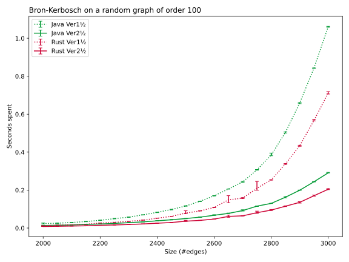

* Among Ver2 variants, GP and GPX are indeed best…
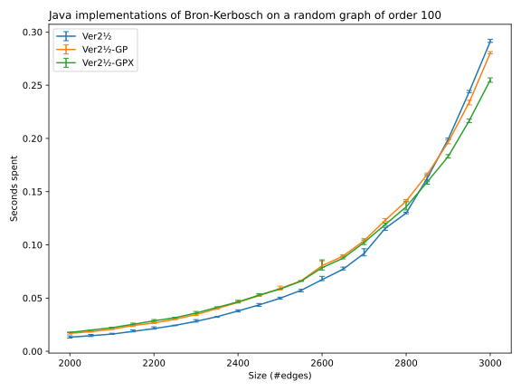
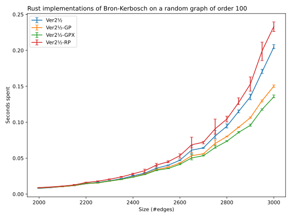

* …but GPX looses ground in big graphs
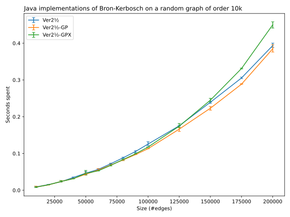
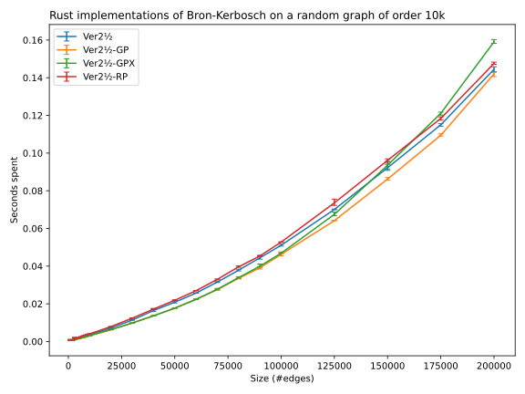

* Ver3-GP barely wins from Ver2-GP in moderately sized graphs…
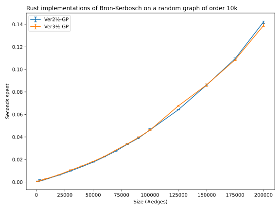
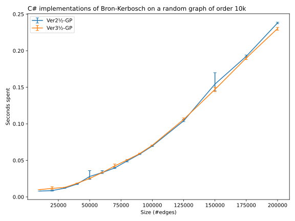

* …but loses in many other cases
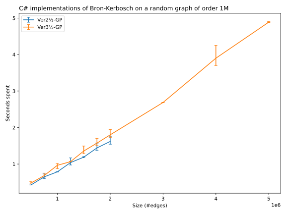
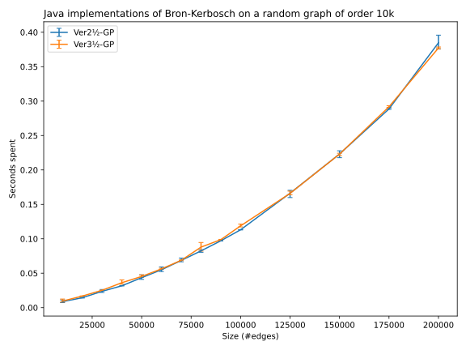

* Ver3-GP seems to cope better at scale than Ver3-GPX
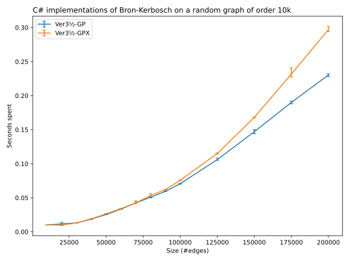
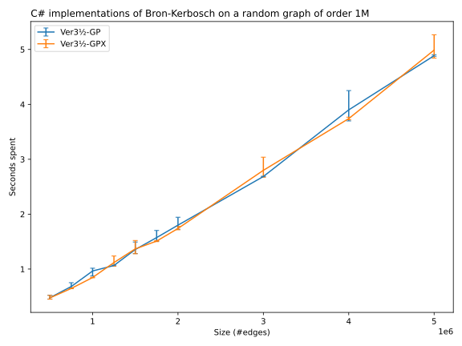
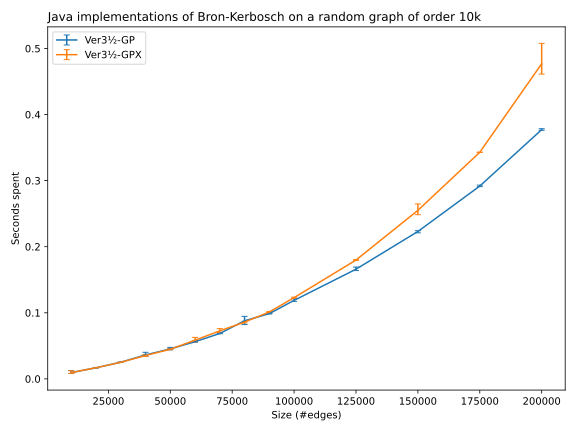

## Introducing parallelism

Let's implement **Ver3-GP** exploiting parallellism (using all CPU cores). How does Ver3 operate?

We already specialized the first iteration in Ver2, and Ver3 changes the order in the first iteration
to the graph's degeneracy order.
So we definitely write [the first iteration separately](python3/bron_kerbosch3_gp.py).
Thus an obvious way to parallelize is to run 2 + N tasks in parallel:
- 1 task generating the degeneracy order of the graph,
- 1 task performing the first iteration in that order,
- 1 or more tasks performing nested iterations.

Ways to implement parallelism varies per language:
* **Ver3½=GPs:** (C#, Java, Scala) using relatively simple composition (async, stream, future)
* **Ver3½=GPc:** (Rust, C++, Java) using something complex resembling channels
* **Ver3½=GP0:** (Go only) using channels and providing 1 goroutine for the nested iterations
* **Ver3½=GP1:** (Go only) using channels and providing 4 goroutines for the nested iterations
* **Ver3½=GP2:** (Go only) using channels and providing 16 goroutines for the nested iterations
* **Ver3½=GPc:** (Go only) using channels and providing 64 goroutines for the nested iterations
* **Ver3½=GP4:** (Go only) using channels and providing 256 goroutines for the nested iterations

### Results
* In Java, simpler multi-threading goes a long way, and more elaborate code shaves off a little more
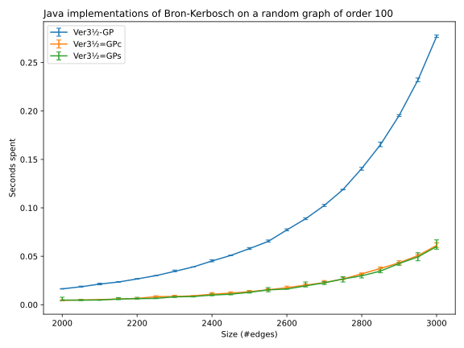
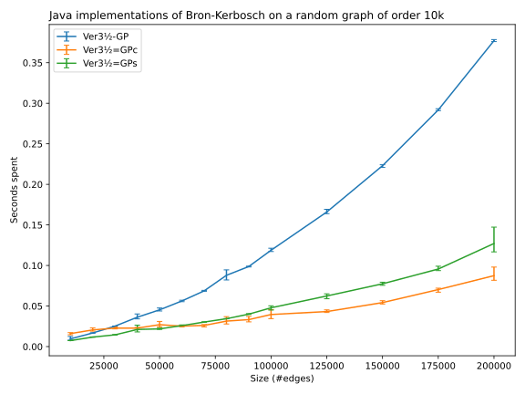
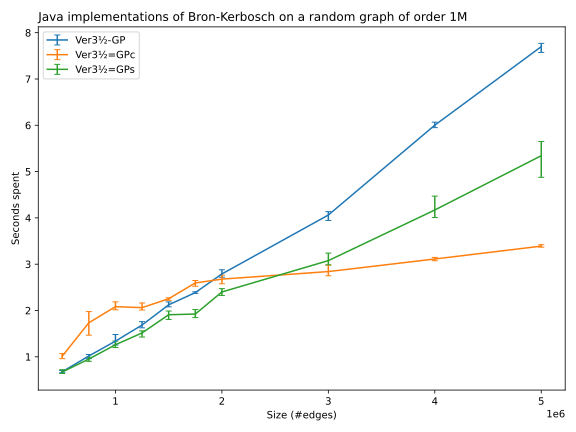

* In Go, Ver3=GP0 shows the overhead of channels if you don't allow much to operate in parallel;
  and there's no need to severely limit the number of goroutines
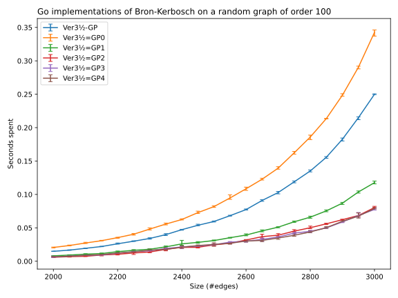
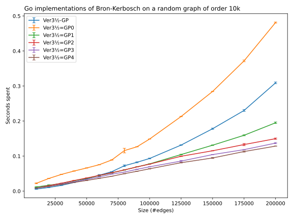
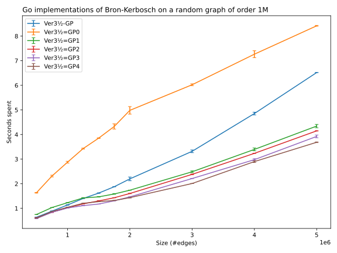

## Comparing languages

* Plain single-threaded
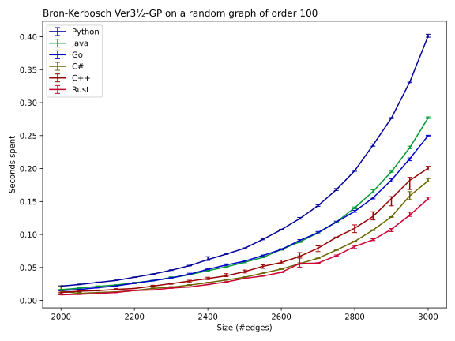
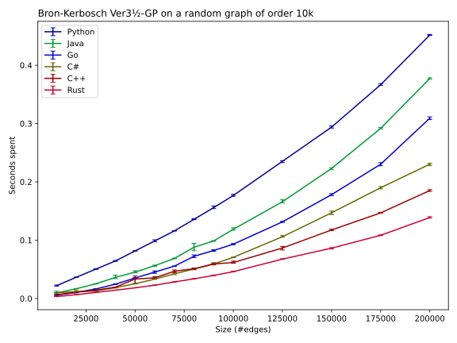

* Relatively simple multi-threaded

* Multi-thread using something resembling channels
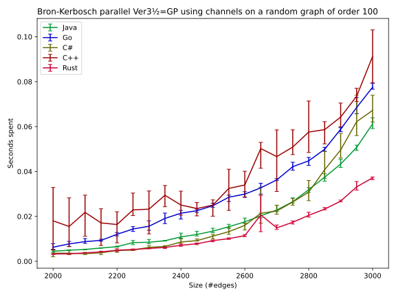
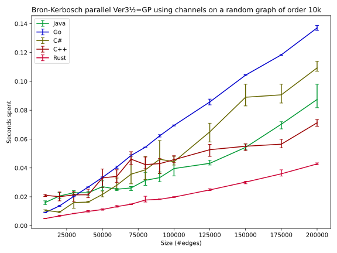
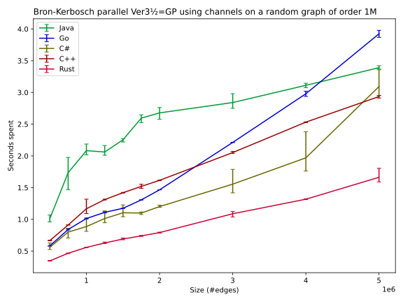

## Comparing implementations of the set data structure

All algorithms work heavily with sets. Some languages allow picking at compile time among
various generic set implementations.

### Rust
* **BTree:** `std::collections::BTreeSet`
* **Hash:** `std::collections::HashSet`, a wrapper around a version of hashbrown
* **hashbrown:** `HashSet` from [crate hashbrown](https://crates.io/crates/hashbrown) 0.11
* **fnv:** `FnvHashSet` from [crate fnv](https://crates.io/crates/fnv) 1.0
* **ord_vec:** ordered `std::collections::Vec` (obviously, this can only work well on small graphs)

#### Results

* Rust (multi-threaded use shows very similar results, but less consistent runs)
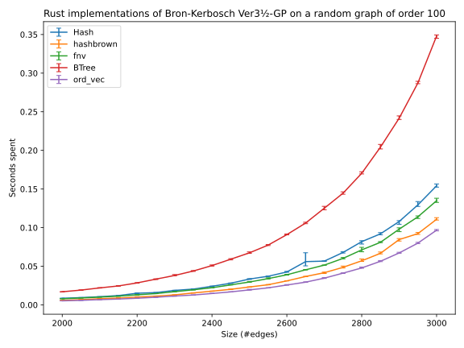
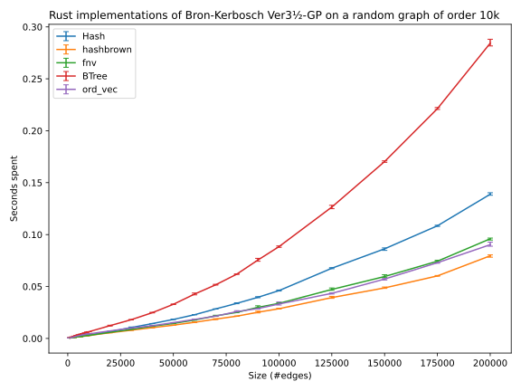
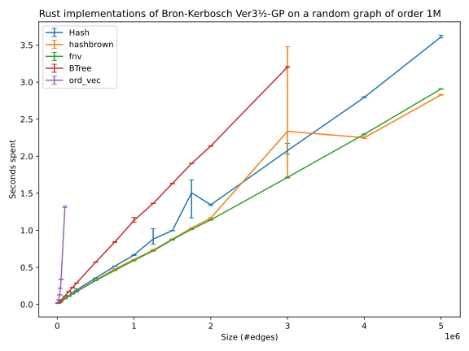

In very sparse graphs, only `BTreeSet` allows Ver1 to scale up.

### C++
* **std_set:** `std::set`
* **hashset:** `std::unordered_set`
* **ord_vec:** ordered `std::vector` (obviously, this can only work well on small graphs)

#### Results

# How to run & test

## Python 3
To obtain these results:
  - [dense graph of order 100](doc/details_python3_100.svg)
  - [plain graph of order 10k](doc/details_python3_10k.svg)
  - [sparse graph of order 1M](doc/details_python3_1M.svg)

Perform

    cd python3
    (once) python -m venv venv
    venv\Scripts\activate.bat
    (once) pip install mypy pytest hypothesis matplotlib
    mypy .
    pytest
    python -O test_maximal_cliques.py

## Rust
To obtain these results:
  - [dense graph of order 100](doc/details_rust_100.svg)
  - [plain graph of order 10k](doc/details_rust_10k.svg)
  - [extremely sparse graph of order 1M](doc/details_rust_1M_initial.svg)
  - [sparse graph of order 1M](doc/details_rust_1M.svg)

Perform

    cd rust
    cargo clippy --workspace
    cargo test --workspace
    cargo run --release

## Go
To obtain these results:
  - [dense graph of order 100](doc/details_go_100.svg)
  - [plain graph of order 10k](doc/details_go_10k.svg)
  - [sparse graph of order 1M](doc/details_go_1M.svg)

Perform

    cd go
    go1.18beta1 vet BronKerbosch/...
    go1.18beta1 test BronKerbosch/...
    go1.18beta1 run BronKerbosch/main

On MSYS2:
    PATH=$PATH:$HOME/Documents/go/bin
    go1.18beta1 test -race BronKerbosch/lib

## C#
To obtain these results:
  - [dense graph of order 100](doc/details_csharp_100.svg)
  - [plain graph of order 10k](doc/details_csharp_10k.svg)
  - [sparse graph of order 1M](doc/details_csharp_1M.svg)

Perform
  - open csharp\BronKerboschStudy.sln with Visual Studio 2022
  - set configuration to Debug
  - Test > Run > All Tests
  - set configuration to Release
  - Solution Explorer > BronKerboschStudy > Set as Startup Project
  - Debug > Start Without Debugging

## C++ 20
To obtain these results:
  - [dense graph of order 100](doc/details_c++_100.svg)
  - [plain graph of order 10k](doc/details_c++_10k.svg)
  - [sparse graph of order 1M](doc/details_c++_1M.svg)

Either:
  - clone or export https://github.com/VaderY/cppcoro locally, e.g. next to this repository
  - open cpp\BronKerboschStudy.sln with Visual Studio 2022
  - set directory to cppcoro (if not `..\cppcoro` relative to Bron-Kerbosch):
    - View > Other Windows > Property Manager
    - in the tree, descend to any project and configuration, open propery page "BronKerboschStudyGeneral"
    - in User Macros, set `CppcoroDir`
  - set configuration to Debug
  - Test > Run > All Tests
  - set configuration to Release
  - Debug > Start Without Debugging

## Java
To obtain these results:
  - [dense graph of order 100](doc/details_java_100.svg)
  - [plain graph of order 10k](doc/details_java_10k.svg)
  - [sparse graph of order 1M](doc/details_java_1M.svg)

Perform
  - open folder java with IntelliJ IDEA 2021 (Community Edition)
  - set run configuration to "Test"
  - Run > Run 'Test'
  - set run configuration to "Main"
  - Run > Run 'Main'

## Scala
To obtain these results:
  - [dense graph of order 100](doc/details_scala_100.svg)
  - [plain graph of order 10k](doc/details_scala_10k.svg)
  - [sparse graph of order 1M](doc/details_scala_1M.svg)

Perform
  - open folder scala with IntelliJ IDEA 2021 (Community Edition)
  - View > Tool Windows > sbt; Reload sbt Project (or Reload All sbt Projects)
  - enable assertions: comment out `"-Xdisable-assertions"` in build.sbt
  - Build > Rebuild Project
  - set run configuration to test
  - Run > Run 'test'
  - disable assertions: uncomment `"-Xdisable-assertions"` in build.sbt
  - Build > Rebuild Project
  - set run configuration to main
  - Run > Run 'main'

## Finally

Python and Rust publish results to the cloud automatically, the others need a push:

    python python3\publish.py go 100 10k 1M
    python python3\publish.py c# 100 10k 1M
    python python3\publish.py c++ 100 10k 1M
    python python3\publish.py java 100 10k 1M
    python python3\publish.py scala 100 10k 1M

And finally, generate images locally:

    python python3\publish.py
    dot doc\Ver3.dot -Tsvg -O

## License

[BSD License](http://opensource.org/licenses/BSD-3-Clause)
